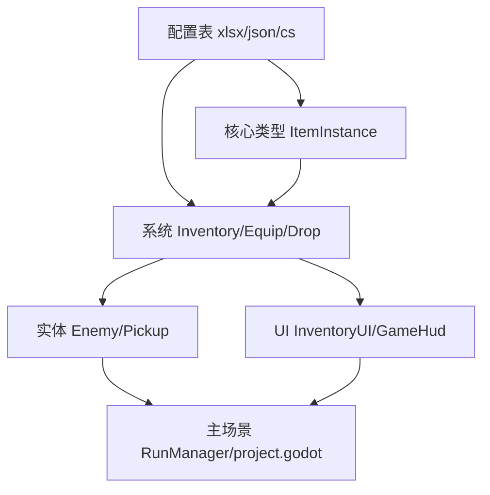

# 分批提交示例

## 示例：物品 / 背包 / 装备系统

假设工作区同时有配置、核心、系统、实体、UI、主场景改动，可按依赖拆成：

| # | Commit | 文件范围 | 说明 |
|---|--------|----------|------|
| 1 | `feat(config): item quality and equip slot tables` | `tools/config/quality.xlsx`, `equip_slot.xlsx`, `assets/config/quality.json`, `equip_slot.json`, `scripts/config/QualityConfig.cs`, `EquipSlotConfig.cs`, `ConfigBootstrap.cs`（仅注册项） | 配置可独立编译 |
| 2 | `feat(config): drop table for enemy loot` | `drop_table` 三件套 + `DropTableConfig.cs` + Bootstrap | 依赖 item/quality 配置 |
| 3 | `feat(core): item instance model` | `scripts/core/ItemInstance.cs` | 纯数据，无场景 |
| 4 | `feat(systems): drop resolution` | `DropTableResolver.cs` | 依赖配置与 ItemInstance |
| 5 | `feat(systems): inventory and equip managers` | `InventoryManager.cs`, `EquipManager.cs` | 依赖 ItemInstance、配置 |
| 6 | `feat(entities): item pickup and enemy drops` | `ItemPickup.cs`, `Enemy.cs`, `Pickup.cs`, `enemy.tscn`, `pickup.tscn` | 掉落链路 |
| 7 | `feat(ui): inventory and equip panel` | `InventoryUI.cs`, `inventory_ui.tscn`, `GameHud.cs`, `game_hud.tscn` | UI 依赖管理器 |
| 8 | `feat(run): wire inventory into main loop` | `RunManager.cs`, `EnemySpawner.cs`, `main.tscn`, `project.godot` | 最后集成 |

每批执行：

```bash
git add <本批文件>
dotnet build hope.csproj
git commit -m "..."
```

## 反例

| 做法 | 问题 |
|------|------|
| 先 commit `InventoryUI.cs`，不含 `InventoryManager` | 编译失败 |
| 只 commit `quality.xlsx`，不含 `quality.json` | 运行时缺配置 |
| `git add .` 一次提交全部 | 无法回滚单个功能，中间态不可审 |
| 跳过 `dotnet build` | 远程/checkout 任意 commit 可能无法编译 |

## Mermaid：依赖顺序


