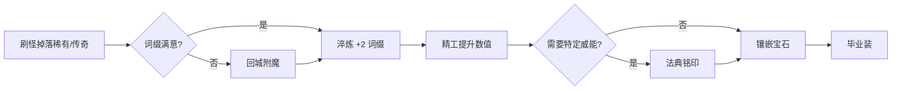

# Hope 装备系统 · 强化篇

> 掉落只是起点；强化系统让玩家在**长线养成**中把装备打造成毕业装  
> 所有强化结果写入 `ItemInstance`，随背包**局外存档**永久保留  
> 前置阅读：[装备基础](装备系统-基础.md)  
> 关联文档：[装备来源](装备系统-来源.md)

---

## 目录

1. [淬炼 (Tempering)](#1-淬炼-tempering)
2. [精工 (Masterworking)](#2-精工-masterworking)
3. [宝石与镶嵌 (Sockets & Gems)](#3-宝石与镶嵌-sockets--gems)
4. [附魔 (Enchanting)](#4-附魔-enchanting)
5. [强化流程总览](#5-强化流程总览)
6. [实现规划](#6-实现规划)

---

## 1. 淬炼 (Tempering)

### 1.1 基本规则

- **适用品质**：稀有、传奇。
- **不适用**：独特（词缀固定）、普通、魔法。
- **效果**：为装备添加 **2 条淬炼词缀**（与随机词缀独立计数）。
- **地点**：主城 · 铁匠（Blacksmith）NPC。

### 1.2 淬炼限制

```
每件装备拥有「淬炼耐久度」（如 3~5 次操作）
  ├── 选择手册 → 随机淬炼词缀 → 确认或重铸
  └── 耐久耗尽后不可再修改淬炼词缀

开始精工前，必须已有 2 条不同的淬炼词缀
```

### 1.3 淬炼手册

手册为消耗品，决定**淬炼词缀池**：

| 手册类型 | 示例效果池 |
|----------|------------|
| 进攻手册 | 伤害、暴击、攻速 |
| 防御手册 | 护甲、生命、减伤 |
| 机动手册 | 移速、闪避冷却、翻滚距离 |
| 资源手册 | 体力恢复、技能冷却 |

来源：野外掉落、地下城宝箱、Boss、任务奖励；**手册与材料均局外囤积**。

### 1.4 与词缀上限的关系

| 品质 | 随机词缀 | 淬炼词缀 | 合计（满配） |
|:----:|:--------:|:--------:|:------------:|
| 稀有 | 4 | +2 | 6 |
| 传奇 | 4 | +2 | 6 + 威能 |

### 1.5 数据结构

```csharp
// ItemInstance 扩展字段（序列化进存档）
public List<RolledAffix> TemperedAffixes { get; set; } = [];
public int TemperDurability { get; set; }  // 剩余淬炼次数
```

`ComputeStatBonus()` 合并 `Affixes` + `TemperedAffixes` + 精工倍率。

---

## 2. 精工 (Masterworking)

### 2.1 精工等级上限

| 子品质 | 最大精工等级 |
|:------:|:------------:|
| 普通 | 8 |
| 远古 | 12 |

**适用**：稀有、传奇、独特（独特仅精工，不淬炼）。

### 2.2 精工提升效果

每级精工作用于**全部词缀**（含淬炼词缀，不含威能）：

| 等级 | 效果 |
|:---:|------|
| 1–3 | 所有词缀数值 +5% |
| **4** | 随机 1 条词缀额外 +25%（UI 标记「精造」） |
| 5–7 | 所有词缀数值 +5% |
| **8** | 再随机 1 条词缀 +25% |
| 9–11 | 所有词缀数值 +5%（仅远古） |
| **12** | 再随机 1 条词缀 +25%（仅远古） |

被 +25% 标记的词缀在 UI 用渐变色区分（蓝 → 黄 → 橙）。

### 2.3 精工重置

- 可消耗材料将精工等级**重置为 0**。
- 装备本身不销毁；已选定的 +25% 词缀位清空，可重新精工规划。

### 2.4 精工材料

| 材料 | 主要来源 |
|------|----------|
| 精炼石 | 精英怪、地下城宝箱 |
| 奥术碎片 | 分解稀有以上装备 |
| 远古核心 | Boss、终局区域 |

材料存入玩家仓库，**跨关卡、跨会话**累积。

### 2.5 数据结构

```csharp
public int MasterworkLevel { get; set; }
public List<int> MasterworkBonusAffixIndices { get; set; } = [];  // +25% 的词缀下标
```

---

## 3. 宝石与镶嵌 (Sockets & Gems)

### 3.1 最大插槽数量

| 装备位 | 最大孔数 |
|:------:|:--------:|
| 靴子、护符（初期可设无孔） | 0 |
| 武器、头盔 | 1 |
| 胸甲 | 2 |

孔数规则以 `socket_rule.xlsx` 为准，可按版本扩展。

### 3.2 添加插槽

- 掉落的稀有以上装备**小概率**自带插槽。
- 铁匠处消耗 **棱镜碎片** 为无孔装备添加 1 孔（每件限 1 次）。

### 3.3 宝石类型

| 宝石 | 武器 | 护甲 | 护符 |
|:----:|------|------|------|
| 红宝石 | +% 伤害 | +生命 | 荆棘 |
| 蓝宝石 | 击杀回能 | 减伤 | 冰霜抗性 |
| 黄宝石 | 基础技能伤害 | 全抗 | 雷电抗性 |
| 绿宝石 | 易伤 | 荆棘 | 毒素抗性 |
| 紫宝石 | 冷却缩减 | 屏障 | 火焰抗性 |
| 钻石 | 全元素伤害 | 全抗 | 全抗 |

宝石为独立 `ItemInstance`（`item.type = gem`），镶嵌不销毁装备；卸下后宝石回到背包。

### 3.4 数据结构

```csharp
public List<int> SocketedGemIds { get; set; } = [];  // 宝石 ConfigId
public int MaxSockets { get; set; }  // 底材 + 打孔
```

---

## 4. 附魔 (Enchanting)

### 4.1 机制

主城 · 神秘学家（Occultist）NPC：

```
选中 1 条随机词缀（不含淬炼词缀、不含固有、不含威能）
  → 消耗金币 + 材料
  → 从同槽位词缀池随机替换为另一条
  → 可重复操作，费用递增
```

回城即可附魔，无「仅战斗间隙」限制。

### 4.2 限制

| 规则 | 说明 |
|------|------|
| 固有属性 | 不可附魔 |
| 强效词缀 | **禁止**——会降为普通词缀 |
| 独特物品 | 不可附魔 |
| 淬炼词缀 | 在淬炼界面重铸，不走附魔 |
| 威能 | 通过法典铭印更改，不走附魔 |
| 每件装备 | 同时只有 **1 条**词缀处于「可附魔选中」状态 |

### 4.3 费用曲线

```
附魔费用 = 基础费 × (1 + 已附魔次数 × 0.25)
```

防止单件装备无限洗词条；鼓励在多件候选间取舍，或刷新区间找新胚子。

### 4.4 长线养成意义

- 附魔是**终局微调**手段：在若干件高 ilvl 装备间洗出理想词缀组合。
- 配合威能铭印，稀有装可先附魔满意后再升为传奇。
- 已附魔次数、费用档位随装备实例存档，换角色不共享（单机单角色存档）。

---

## 5. 强化流程总览

### 5.1 推荐养成路径



### 5.2 品质与强化权限矩阵

| 品质 | 附魔 | 淬炼 | 精工 | 打孔 | 铭印威能 |
|:----:|:----:|:----:|:----:|:----:|:--------:|
| 普通 | — | — | — | — | — |
| 魔法 | — | — | — | — | — |
| 稀有 | ✓ | ✓ | ✓ | ✓ | ✓（升传奇） |
| 传奇 | ✓ | ✓ | ✓ | ✓ | ✓（覆盖威能） |
| 独特 | — | — | ✓ | ✓ | — |

### 5.3 持久经济

刷宝 ARPG 下，资源在**角色生涯**内循环：

| 资源 | 获取 | 消耗 | 存档 |
|------|------|------|:----:|
| 金币 | 杀怪、卖装备 | 附魔、铭印 | ✓ |
| 材料 | 分解、精英、Boss | 淬炼、精工、打孔 | ✓ |
| 手册 | 掉落、任务 | 淬炼 | ✓ |
| 装备实例 | 掉落、赌博 | 穿戴、分解、强化 | ✓ |

**设计目标**：玩家可长期打磨同一套装备至满精工；材料与法典进度随游戏时长自然积累，而非每局清零重来。

---

## 6. 实现规划

### 6.1 模块划分

| 模块 | 类型 | 职责 |
|------|------|------|
| `CraftingManager` | Autoload（局外） | 附魔、淬炼、精工、打孔 |
| `AspectCodexManager` | Autoload（局外） | 威能法典 |
| `SaveManager` | Autoload | 存档读写（见 [存档方案](存档方案.md)） |
| `GemSocketService` | 静态 / 组件 | 镶嵌 / 卸下宝石 |
| 主城 UI | 独立场景 | 铁匠 / 神秘学家 / 珠宝匠 / 赌博师 |

### 6.2 持久化策略

| 数据 | 存档 | 说明 |
|------|:----:|------|
| 背包、装备栏 | ✓ | 含全部 `ItemInstance` 强化字段 |
| 金币、材料、手册 | ✓ | 玩家仓库 |
| 威能法典 | ✓ | 已解锁威能等级 |
| 关卡内未拾取掉落 | ✗ | 离开区域消失 |
| 战斗临时状态 | ✗ | 不写入存档 |

进出战斗场景**不触发**装备或背包清空；仅显式删档或新角色时重置。

### 6.3 实现优先级

| 优先级 | 功能 | 理由 |
|:------:|------|------|
| P0 | 局外存档 + 背包持久化 | 刷宝游戏根基 |
| P1 | 附魔 | 最直接的长线构筑灵活性 |
| P2 | 威能铭印 | 核心差异化 |
| P3 | 精工 | 终局数值追求 |
| P4 | 淬炼 | 扩展词缀上限 |
| P5 | 宝石镶嵌 | 锦上添花 |

### 6.4 配置表

| 表 | 字段示例 |
|----|----------|
| `temper_manual.xlsx` | id, affix_pool, weight |
| `masterwork_cost.xlsx` | level, material_id, count |
| `enchant_cost.xlsx` | base_gold, material_id, scale |
| `gem.xlsx` | id, weapon_effect, armor_effect, amulet_effect |
| `socket_rule.xlsx` | slot_type, max_sockets, prism_cost |

---

> 最后更新：2026年7月
